# practica2cromos
En este informe encontrará como ejecutar el proyecto de diferentes maneras, los enpoints disponibles con ejemplos usando cURL (junto con las correspondientes capturas de pantalla) y una breve descripción del modelo de datos.

****************** EJECUCIÓN DEL PROYECTO ****************** 

(En ambos casos se da por hecho que el proyecto ha sido descargado previamente y se encuentra en un repositorio local).

- Usando Eclipse Boot Dashboard - 

Una vez abierto Eclipse y estando ubicado en el proyecto, deberá buscar la ventana Boot Dashboard, de no encontrarla podrá dirigirse al menu superior -> Window -> Show View ->  Boot Dashboard.

Tras ubicarse en la correspondiente ventana verá la palabra "local" "junto con un hexágono verde, debera hacer click en la flecha que se encuentra a la izquierda de estos. 

Verá que se le habran desplegado uno o más proyectos, busque entre ellos el que se llame "gestorcromos".

Una vez lo ubique, haga click derecho sobre él y pulse la opción (Re)rtart 
Y así dará comienzo la ejecución del programa. 

- Usando Eclipse Project Explorer - 

Una abierto Eclipse y estando ubicado en el proyecto correspondiente, verá a la izquierda todos los proyectos que tiene, de no ser así podrá dirigirse al menu superior -> Window -> Show View ->  Project Explorer.

Una vez abierta la ventaba Project Explorer, localice el proyecto actual llamado "gestorcromos". Haga click derecho sobre él -> Run As -> Spring Boot App.
Y así dará comienzo la ejecución del programa.

****************** ENDPOINTS DISPONIBLES ****************** 

Las pruebas de los endpoints se han realizado con cURL, una herramienta de línea de comandos que permite ejecutar peticiones HTTP desde la terminal. Para poder usarla deberá ubicarse en la carpeta del proyecto desde la terminar, una vez ahí podrá ejecutar diferentes comandos depeniendo el endpoitn que quieras testear.

A continuación, se muestran los respectivos ejemplos:

** >>>>>>>> POST /api/v1/cromos <<<<<<<<**

Crea un nuevo cromo en la base de datos

Este comando envía un objeto JSON al servidor para crear un nuevo cromo.  
Si todos los datos cumplen las validaciones del backend, el servidor devuelve un 201 Created junto con el cromo creado.

-- Comando cURL --

curl -i -X POST http://localhost:8080/api/v1/cromos \
  -H "Content-Type: application/json" \
  -d '{
        "nombre": "Goku Ultra Instinto",
        "serie": "DragonBall",
        "numero": 5,
        "rareza": "Legendario",
        "anio": 2021,
        "repetido": false
      }'
      
      
      
-- Respuesta esperada --
     
HTTP/1.1 201 Created

Content-Type: application/json

{
  "id": 1,
  "nombre": "Goku Ultra Instinto",
  "serie": "DragonBall",
  "numero": 5,
  "rareza": "Legendario",
  "anio": 2021,
  "repetido": false
}

Código: 201 Created - Resultado: Cromo creado correctamente

Código: 400 Bad Request - Resultado: errorValidation con su respectivo mensaje;

**Prueba POST correcto**

 

**Prueba POST incorrecto**

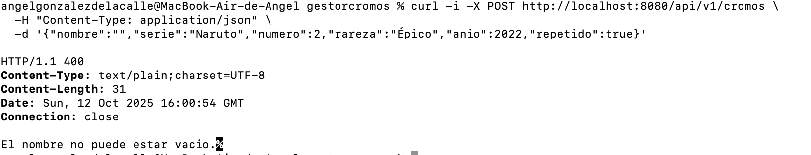

** >>>>>>>> GET ALL /api/v1/cromos <<<<<<<<<**

Devuelve una lista completa con todos los cromos existentes en la base de datos.
Si no hay registros, responde con un 204 No Content.

-- Comando cURL --

curl -i -X GET http://localhost:8080/api/v1/cromos

-- Respuesta esperada --

HTTP/1.1 200 OK

Content-Type: application/json

[
  {
    "id": 1,
    "nombre": "Goku Ultra Instinto",
    "serie": "DragonBall",
    "numero": 5,
    "rareza": "Legendario",
    "anio": 2021,
    "repetido": false
  },
  {
    "id": 2,
    "nombre": "Vegeta Super Saiyan",
    "serie": "DragonBall",
    "numero": 6,
    "rareza": "Épico",
    "anio": 2020,
    "repetido": false
  }
]
Código: 200 OK - Resultado: Lista de cromos recuperada correctamente
Código: 204 No Content (si la lista está vacía)

**Prueba GET ALL**

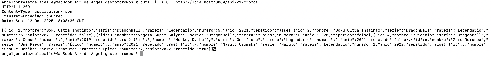

** Prueba GET ALL vacía **

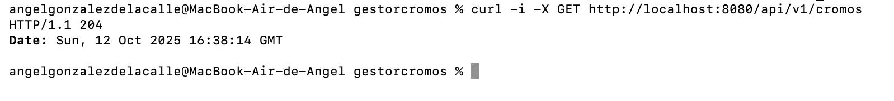

** >>>>>>>> GET /api/v1/cromos/{id} <<<<<<<<**

Busca un cromo por su identificador
Si existe, devuelve el objeto; si no, un mensaje con 404 Not Found.

-- Comando cURL -- 

curl -i -X GET http://localhost:8080/api/v1/cromos/1

-- Respuesta esperada -- 

HTTP/1.1 200 OK

Content-Type: application/json

{
  "id": 1,
  "nombre": "Goku Ultra Instinto",
  "serie": "DragonBall",
  "numero": 5,
  "rareza": "Legendario",
  "anio": 2021,
  "repetido": false
}
Código: 200 OK
Código: 404 Not Found (si el ID no existe)

**Prueba GetById**

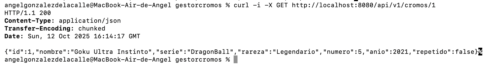

**Prueba GetById failed **

 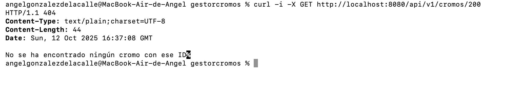

** >>>>>>>> PUT /api/v1/cromos/{id} <<<<<<<<**

Reemplaza completamente un cromo existente con nuevos datos.
El ID del recurso debe existir; si no, devuelve 404 Not Found.
Si los datos no pasan las validaciones, devuelve 400 Bad Request.

-- Comando cURL -- 

curl -i -X PUT http://localhost:8080/api/v1/cromos/1 \
  -H "Content-Type: application/json" \
  -d '{
        "nombre": "Goku Blue",
        "serie": "DragonBall Super",
        "numero": 7,
        "rareza": "Épico",
        "anio": 2021,
        "repetido": true
      }'

-- Respuesta esperada -- 

HTTP/1.1 200 OK

Content-Type: application/json

{
  "id": 1,
  "nombre": "Goku Blue",
  "serie": "DragonBall Super",
  "numero": 7,
  "rareza": "Épico",
  "anio": 2021,
  "repetido": true
}

Código: 200 OK
Código: 404 Not Found (si el ID no existe)
Código: 400 Bad Request (si los datos no son válidos)

** Prueba Put **

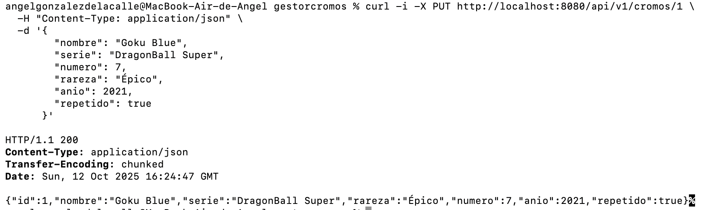 

** Prueba Put failed for Bad Request **

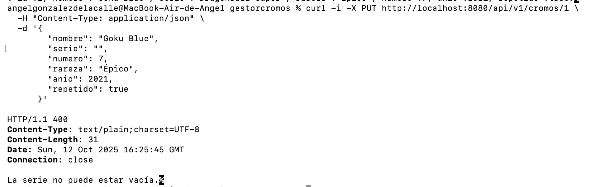

** Prueba Put failed for Id **

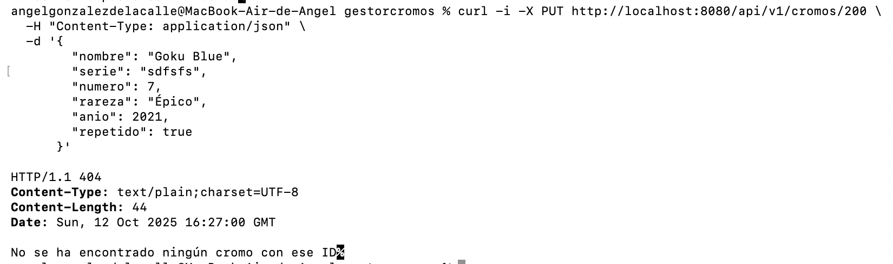

** >>>>>>>> DELETE /api/v1/cromos/{id} <<<<<<<< **

Elimina de la base de datos el cromo con el ID indicado.
Si se elimina correctamente, devuelve 204 No Content.
Si el ID no existe, devuelve 404 Not Found.

-- Comando cURL -- 

curl -i -X DELETE http://localhost:8080/api/v1/cromos/1

-- Respuesta esperada --

HTTP/1.1 204 No Content

Código: 204 No Content
Código: 404 Not Found (si no se encuentra el cromo)

** Prueba Delete **

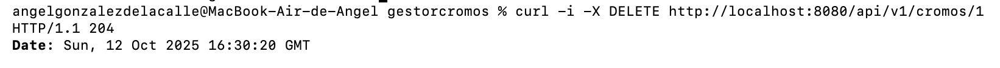 

**Prueba delete failed**

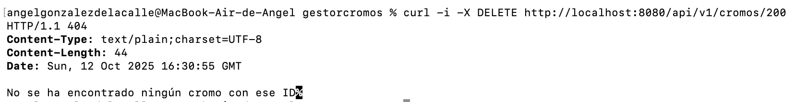

** >>>>>>>> GET /api/v1/cromos/search?serie=... <<<<<<<<**

Permite buscar todos los cromos que pertenezcan a una serie concreta.
El parámetro de búsqueda se envía con ?serie=.
Si no se encuentran coincidencias, devuelve 404 Not Found.

-- Comando cURL --

curl -i -G http://localhost:8080/api/v1/cromos/search \
  --data-urlencode "serie=DragonBall"
  
-- Respuesta esperada --

HTTP/1.1 200 OK

Content-Type: application/json

[
  {
    "id": 1,
    "nombre": "Goku Ultra Instinto",
    "serie": "DragonBall",
    "numero": 5,
    "rareza": "Legendario",
    "anio": 2021,
    "repetido": false
  },
  {
    "id": 2,
    "nombre": "Vegeta Super Saiyan",
    "serie": "DragonBall",
    "numero": 6,
    "rareza": "Épico",
    "anio": 2020,
    "repetido": false
  }
]
Código: 200 OK - Resultado: Lista filtrada por serie
Código: 404 Not Found (si no hay cromos en esa serie)

**Prueba GET by serie **

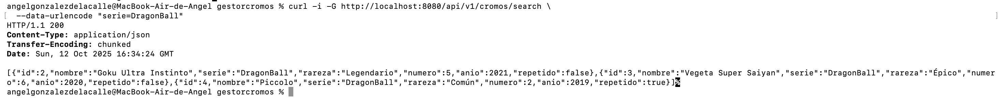 

**Prueba GET by serie empty **

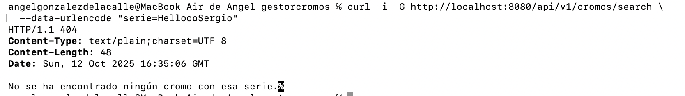

****************** DESCRIPCIÓN MODELO DE DATOS ****************** 

El modelo de datos de este proyecto está formado por una única entidad llamada Cromo, que representa cada carta o sticker coleccionable almacenado en la base de datos.

Esta clase está mapeada con JPA (Java Persistence API), lo que permite que Spring Boot cree automáticamente la tabla correspondiente llamada cromos en la base de datos H2 cuando se ejecuta la aplicación.

Cada objeto de tipo Cromo se traduce en un registro dentro de esa tabla, y contiene los siguientes atributos:

id: número identificador único generado automáticamente por el sistema.
nombre: nombre del cromo o personaje (no puede estar vacío ni ser nulo).

serie: nombre de la serie o colección a la que pertenece el cromo (por ejemplo, DragonBall o Naruto).

numero: número dentro de la colección; debe ser mayor que cero.

rareza: nivel de rareza del cromo (por ejemplo, Común, Épico o Legendario).

anio: año de publicación o lanzamiento del cromo; debe estar comprendido entre 1990 y el año actual.

repetido: valor booleano (true o false) que indica si el cromo está repetido o no.

Además, el campo id está anotado con @Id y @GeneratedValue(strategy = GenerationType.IDENTITY), lo que significa que su valor se genera automáticamente en la base de datos al insertar un nuevo registro.

En resumen, la entidad Cromo define la estructura fundamental del proyecto, permitiendo gestionar de manera organizada los diferentes cromos mediante operaciones CRUD (crear, leer, actualizar y eliminar) a través de la API REST.

Este modelo de datos se complementa con el repositorio, el servicio y el controlador, que juntos permiten realizar todas las operaciones CRUD (crear, leer, actualizar y eliminar) sobre la entidad Cromo mediante peticiones REST.
